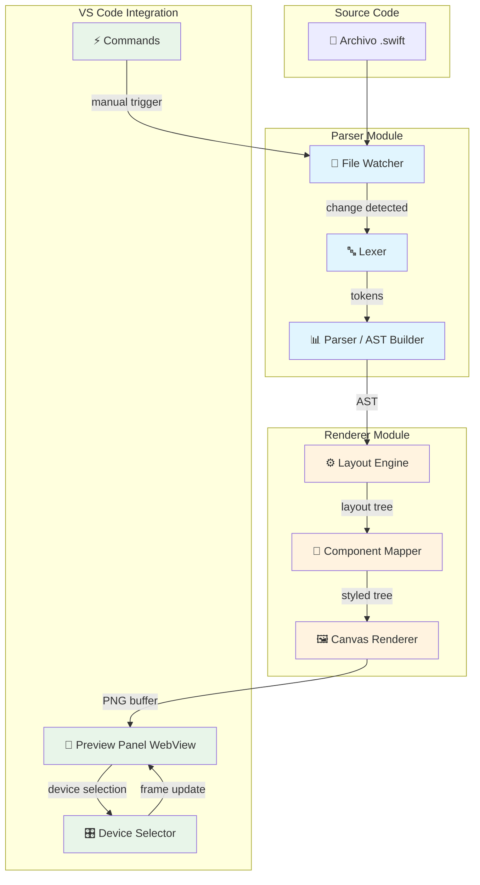
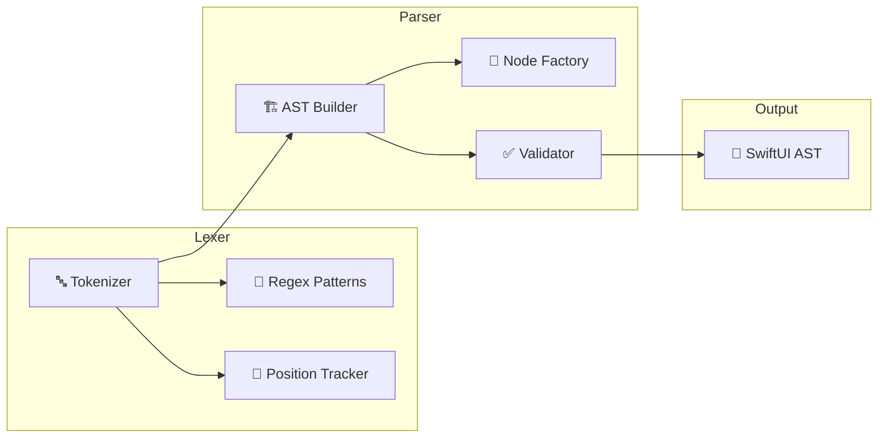

# DISEÑO - Diseño de la Solución

**Proyecto:** OpenSUI - Extensión de Visual Studio Code para Previsualización de SwiftUI

**Versión del documento:** 1.0

**Fecha:** 25 de abril de 2026

**Autor:** OpenSUI Dev Agent

---

## 1. Arquitectura del Sistema

### 1.1 Vista General



### 1.2 Flujo de Datos

```
┌─────────────────────────────────────────────────────────────────┐
│                      CICLO DE RENDERIZADO                         │
└─────────────────────────────────────────────────────────────────┘

  1. File Change           8. WebView Update
     Event                      ↓
        ↓                  ┌─────────────────┐
  2. Debounce             │  Preview Panel  │
     (300ms)             │    (WebView)     │
        ↓                  └─────────────────┘
  3. Lexer                     ↑
     Tokenization            7. Frame Compose
        ↓                  (Canvas)
  4. Parser               ↑
     AST Build            6. Render
        │                (node-canvas)
  5. Layout Engine
     (calculations)
        ↓
  5.1 Alignment
  5.2 Spacing
  5.3 Sizing
```

### 1.3 Componentes del Módulo de Parser



---

## 2. Diseño del Lexer

### 2.1 Tipos de Tokens

```typescript
export enum TokenType {
  // Structural
  STRUCT = 'STRUCT',
  CLASS = 'CLASS',
  FUNC = 'FUNC',
  VAR = 'VAR',
  LET = 'LET',

  // SwiftUI Components
  VIEW = 'VIEW',
  VSTACK = 'VSTACK',
  HSTACK = 'HSTACK',
  ZSTACK = 'ZSTACK',
  LAZYVSTACK = 'LAZYVSTACK',
  LAZYHSTACK = 'LAZYHSTACK',
  SPACER = 'SPACER',
  DIVIDER = 'DIVIDER',

  TEXT = 'TEXT',
  LABEL = 'LABEL',
  TEXTFIELD = 'TEXTFIELD',
  SECUREFIELD = 'SECUREFIELD',
  TEXTEDITOR = 'TEXTEDITOR',

  IMAGE = 'IMAGE',
  ASYNCIMAGE = 'ASYNCIMAGE',

  BUTTON = 'BUTTON',
  TOGGLE = 'TOGGLE',
  SLIDER = 'SLIDER',
  PICKER = 'PICKER',
  STEPPER = 'STEPPER',
  DATEPICKER = 'DATEPICKER',

  LIST = 'LIST',
  SCROLLVIEW = 'SCROLLVIEW',
  NAVIGATIONSTACK = 'NAVIGATIONSTACK',
  NAVIGATIONVIEW = 'NAVIGATIONVIEW',
  TABVIEW = 'TABVIEW',

  // Modifiers
  PADDING = 'PADDING',
  FRAME = 'FRAME',
  BACKGROUND = 'BACKGROUND',
  FOREGROUNDCOLOR = 'FOREGROUNDCOLOR',
  FONT = 'FONT',
  BOLD = 'BOLD',
  ITALIC = 'ITALIC',
  LINELIMIT = 'LINELIMIT',
  MULTILINETEXTALIGNMENT = 'MULTILINETEXTALIGNMENT',
  RESIZABLE = 'RESIZABLE',
  ASPECTRATIO = 'ASPECTRATIO',

  // Layout modifiers
  ALIGNMENT = 'ALIGNMENT',
  SPACING = 'SPACING',

  // Values
  STRING = 'STRING',
  NUMBER = 'NUMBER',
  BOOLEAN = 'BOOLEAN',
  COLOR = 'COLOR',

  // Punctuation
  LBRACE = 'LBRACE',
  RBRACE = 'RBRACE',
  LPAREN = 'LPAREN',
  RPAREN = 'RPAREN',
  LBRACKET = 'LBRACKET',
  RBRACKET = 'RBRACKET',
  DOT = 'DOT',
  COMMA = 'COMMA',
  COLON = 'COLON',
  EQUALS = 'EQUALS',

  // Special
  NEWLINE = 'NEWLINE',
  COMMENT = 'COMMENT',
  EOF = 'EOF',
  UNKNOWN = 'UNKNOWN',
}
```

### 2.2 Definición de Token

```typescript
export interface Token {
  type: TokenType;
  value: string;
  line: number;
  column: number;
  startIndex: number;
  endIndex: number;
}
```

### 2.3 Patrones Regex del Lexer

```typescript
const TOKEN_PATTERNS: Array<{ type: TokenType; pattern: RegExp }> = [
  // Comments
  { type: TokenType.COMMENT, pattern: /^(\/\/.*|\/\*[\s\S]*?\*\/)/ },

  // Strings
  { type: TokenType.STRING, pattern: /^"([^"\\]|\\.)*"/ },

  // Numbers
  { type: TokenType.NUMBER, pattern: /^-?\d+(\.\d+)?/ },

  // Booleans
  { type: TokenType.BOOLEAN, pattern: /^(true|false)\b/ },

  // Colors
  { type: TokenType.COLOR, pattern: /^Color\.\w+/ },

  // SwiftUI Components (in order of specificity)
  { type: TokenType.NAVIGATIONSTACK, pattern: /^NavigationStack\b/ },
  { type: TokenType.NAVIGATIONVIEW, pattern: /^NavigationView\b/ },
  { type: TokenType.LAZYVSTACK, pattern: /^LazyVStack\b/ },
  { type: TokenType.LAZYHSTACK, pattern: /^LazyHStack\b/ },
  { type: TokenType.ASYNCIMAGE, pattern: /^AsyncImage\b/ },
  { type: TokenType.SCROLLVIEW, pattern: /^ScrollView\b/ },
  { type: TokenType.SECUREFIELD, pattern: /^SecureField\b/ },
  { type: TokenType.TEXTEDITOR, pattern: /^TextEditor\b/ },
  { type: TokenType.TEXTFIELD, pattern: /^TextField\b/ },
  { type: TokenType.DATEPICKER, pattern: /^DatePicker\b/ },
  { type: TokenType.NAVIGATIONVIEW, pattern: /^NavigationView\b/ },
  { type: TokenType.VSTACK, pattern: /^VStack\b/ },
  { type: TokenType.HSTACK, pattern: /^HStack\b/ },
  { type: TokenType.ZSTACK, pattern: /^ZStack\b/ },
  { type: TokenType.LIST, pattern: /^List\b/ },
  { type: TokenType.TABVIEW, pattern: /^TabView\b/ },
  { type: TokenType.LABEL, pattern: /^Label\b/ },
  { type: TokenType.PICKER, pattern: /^Picker\b/ },
  { type: TokenType.STEPPER, pattern: /^Stepper\b/ },
  { type: TokenType.TOGGLE, pattern: /^Toggle\b/ },
  { type: TokenType.SLIDER, pattern: /^Slider\b/ },
  { type: TokenType.SPACER, pattern: /^Spacer\b/ },
  { type: TokenType.DIVIDER, pattern: /^Divider\b/ },
  { type: TokenType.TEXT, pattern: /^Text\b/ },
  { type: TokenType.IMAGE, pattern: /^Image\b/ },
  { type: TokenType.BUTTON, pattern: /^Button\b/ },

  // Modifiers
  { type: TokenType.PADDING, pattern: /^\.padding\b/ },
  { type: TokenType.FRAME, pattern: /^\.frame\b/ },
  { type: TokenType.BACKGROUND, pattern: /^\.background\b/ },
  { type: TokenType.FOREGROUNDCOLOR, pattern: /^\.foregroundColor\b/ },
  { type: TokenType.FONT, pattern: /^\.font\b/ },
  { type: TokenType.BOLD, pattern: /^\.bold\b/ },
  { type: TokenType.ITALIC, pattern: /^\.italic\b/ },
  { type: TokenType.LINELIMIT, pattern: /^\.lineLimit\b/ },
  { type: TokenType.RESIZABLE, pattern: /^\.resizable\b/ },
  { type: TokenType.ASPECTRATIO, pattern: /^\.aspectRatio\b/ },

  // Keywords
  { type: TokenType.STRUCT, pattern: /^struct\b/ },
  { type: TokenType.CLASS, pattern: /^class\b/ },
  { type: TokenType.FUNC, pattern: /^func\b/ },
  { type: TokenType.VAR, pattern: /^var\b/ },
  { type: TokenType.LET, pattern: /^let\b/ },

  // Identifiers
  { type: TokenType.VIEW, pattern: /^: View\b/ },

  // Punctuation
  { type: TokenType.LBRACE, pattern: /^\{/ },
  { type: TokenType.RBRACE, pattern: /^}/ },
  { type: TokenType.LPAREN, pattern: /^\(/ },
  { type: TokenType.RPAREN, pattern: /^)/ },
  { type: TokenType.LBRACKET, pattern: /^\[/ },
  { type: TokenType.RBRACKET, pattern: /^]/ },
  { type: TokenType.DOT, pattern: /^\./ },
  { type: TokenType.COMMA, pattern: /^,/ },
  { type: TokenType.COLON, pattern: /^:/ },
  { type: TokenType.EQUALS, pattern: /^=/ },

  // Whitespace
  { type: TokenType.NEWLINE, pattern: /^\s+/ },
];
```

### 2.4 Implementación del Lexer

```typescript
export class Lexer {
  private source: string;
  private position: number;
  private line: number;
  private column: number;

  constructor(source: string) {
    this.source = source;
    this.position = 0;
    this.line = 1;
    this.column = 1;
  }

  tokenize(): Token[] {
    const tokens: Token[] = [];

    while (this.position < this.source.length) {
      const token = this.nextToken();
      if (token && token.type !== TokenType.NEWLINE) {
        tokens.push(token);
      }
    }

    tokens.push({
      type: TokenType.EOF,
      value: '',
      line: this.line,
      column: this.column,
      startIndex: this.position,
      endIndex: this.position,
    });

    return tokens;
  }

  private nextToken(): Token | null {
    for (const { type, pattern } of TOKEN_PATTERNS) {
      pattern.lastIndex = this.position;
      const match = this.source.match(pattern);

      if (match) {
        const value = match[0];
        const token: Token = {
          type,
          value,
          line: this.line,
          column: this.column,
          startIndex: this.position,
          endIndex: this.position + value.length,
        };

        this.advance(value);
        return token;
      }
    }

    // Unknown character - advance one
    const char = this.source[this.position];
    this.position++;
    this.column++;

    return {
      type: TokenType.UNKNOWN,
      value: char,
      line: this.line,
      column: this.column - 1,
      startIndex: this.position - 1,
      endIndex: this.position,
    };
  }

  private advance(value: string): void {
    for (const char of value) {
      if (char === '\n') {
        this.line++;
        this.column = 1;
      } else {
        this.column++;
      }
    }
    this.position += value.length;
  }
}
```

---

## 3. Diseño del Parser

### 3.1 Gramática EBNF

```
swiftui_file      ::= view_declaration view_body
view_declaration ::= 'struct' identifier ':' 'View'
view_body       ::= '{' view_content '}'
view_content    ::= (component | modifier)*
component      ::= container_component
                  | basic_component
container_component
                  ::= 'VStack' arguments? view_content
                  | 'HStack' arguments? view_content
                  | 'ZStack' arguments? view_content
                  | 'LazyVStack' arguments? view_content
                  | 'LazyHStack' arguments? view_content
                  | 'List' arguments? view_content
                  | 'ScrollView' arguments? view_content
                  | 'NavigationStack' arguments? view_content
                  | 'NavigationView' arguments? view_content
                  | 'TabView' arguments? view_content
basic_component
                  ::= 'Text' arguments
                  | 'Label' arguments
                  | 'Button' arguments
                  | 'Image' arguments
                  | 'AsyncImage' arguments
                  | 'Toggle' arguments
                  | 'Slider' arguments
                  | 'Picker' arguments
                  | 'TextField' arguments
                  | 'SecureField' arguments
                  | 'TextEditor' arguments
                  | 'Stepper' arguments
                  | 'DatePicker' arguments
                  | 'Spacer' arguments?
                  | 'Divider' arguments?
                  | 'List' arguments?
arguments       ::= '(' (argument (',' argument)*)? ')'
argument        ::= (identifier ':' expression | 'label:' view_content)
expression      ::= STRING
                  | NUMBER
                  | BOOLEAN
                  | identifier
                  | identifier '.' identifier
modifier        ::= '.' identifier arguments?
```

### 3.2 Estructura del AST

```typescript
export interface SwiftUIComponentTree {
  root: SwiftUIComponent;
  metadata: {
    sourceFile: string;
    parsedAt: Date;
    version: string;
  };
}

export interface SwiftUIComponent {
  type: ComponentType;
  props: ComponentProperties;
  children: SwiftUIComponent[];
  modifiers: Modifier[];
  sourceRange?: SourceRange;
}

export type ComponentType =
  | 'VStack'
  | 'HStack'
  | 'ZStack'
  | 'LazyVStack'
  | 'LazyHStack'
  | 'Spacer'
  | 'Divider'
  | 'Text'
  | 'Label'
  | 'TextField'
  | 'SecureField'
  | 'TextEditor'
  | 'Image'
  | 'AsyncImage'
  | 'Button'
  | 'Toggle'
  | 'Slider'
  | 'Picker'
  | 'Stepper'
  | 'DatePicker'
  | 'List'
  | 'ScrollView'
  | 'NavigationStack'
  | 'NavigationView'
  | 'TabView';

export interface ComponentProperties {
  // Text properties
  text?: string;
  font?: FontWeight | FontStyle;
  foregroundColor?: string;
  isBold?: boolean;
  isItalic?: boolean;
  lineLimit?: number;
  multilineTextAlignment?: 'leading' | 'center' | 'trailing';

  // Layout properties
  alignment?: Alignment;
  spacing?: number;
  minLength?: number;

  // Image properties
  systemName?: string;
  resizable?: boolean;
  aspectRatio?: number;

  // Frame properties
  width?: number;
  height?: number;
  minWidth?: number;
  maxWidth?: number;
  minHeight?: number;
  maxHeight?: number;
  alignmentFrame?: Alignment;

  // Background properties
  backgroundColor?: string;
  cornerRadius?: number;

  // Other properties
  placeholder?: string;
  role?: 'primary' | 'secondary' | 'destructive';

  // Binding placeholders (for interactive components)
  bindingValue?: string;

  // Label (for compound components)
  labelTitle?: string;
  labelIcon?: string;
}

export type FontWeight = 'largeTitle' | 'title' | 'title2' | 'title3' | 'headline' | 'body' | 'callout' | 'subheadline' | 'footnote' | 'caption' | 'caption2';

export type FontStyle = 'regular' | 'italic';

export type Alignment = 'leading' | 'center' | 'trailing' | 'top' | 'bottom' | 'topLeading' | 'topTrailing' | 'bottomLeading' | 'bottomTrailing';

export interface Modifier {
  type: ModifierType;
  args: ModifierArgs;
}

export type ModifierType =
  | 'padding'
  | 'frame'
  | 'background'
  | 'foregroundColor'
  | 'font'
  | 'bold'
  | 'italic'
  | 'lineLimit'
  | 'multilineTextAlignment'
  | 'resizable'
  | 'aspectRatio';

export interface ModifierArgs {
  padding?: number | EdgeInsets;
  frame?: FrameArgs;
  background?: ColorArgs;
  foregroundColor?: ColorArgs;
  font?: FontArgs;
  bold?: boolean;
  italic?: boolean;
  lineLimit?: number;
  multilineTextAlignment?: 'leading' | 'center' | 'trailing';
  resizable?: boolean;
  aspectRatio?: AspectRatioArgs;
}

export interface EdgeInsets {
  top?: number;
  bottom?: number;
  leading?: number;
  trailing?: number;
}

export interface FrameArgs {
  width?: number;
  height?: number;
  minWidth?: number;
  maxWidth?: number;
  minHeight?: number;
  maxHeight?: number;
  alignment?: Alignment;
}

export interface ColorArgs {
  color: string;
  opacity?: number;
}

export interface FontArgs {
  weight?: FontWeight;
  style?: FontStyle;
}

export interface AspectRatioArgs {
  value: number;
  contentMode: 'fit' | 'fill';
}

export interface SourceRange {
  start: Position;
  end: Position;
}

export interface Position {
  line: number;
  column: number;
  index: number;
}
```

### 3.3 Implementación del Parser

```typescript
export class Parser {
  private tokens: Token[];
  private position: number;
  private errors: ParseError[];

  constructor(tokens: Token[]) {
    this.tokens = tokens;
    this.position = 0;
    this.errors = [];
  }

  parse(): SwiftUIComponentTree {
    const viewDeclaration = this.parseViewDeclaration();
    const viewBody = this.parseViewBody();

    return {
      root: {
        type: 'root',
        props: {},
        children: [viewDeclaration],
        modifiers: [],
      },
      metadata: {
        sourceFile: '',
        parsedAt: new Date(),
        version: '1.0.0',
      },
    };
  }

  private parseViewDeclaration(): SwiftUIComponent {
    this.expect(TokenType.STRUCT);
    const name = this.expect(TokenType.UNKNOWN).value;
    this.expect(TokenType.COLON);
    this.expect(TokenType.VIEW);
    this.expect(TokenType.LBRACE);

    return {
      type: name as ComponentType,
      props: {},
      children: this.parseViewContent(),
      modifiers: [],
    };
  }

  private parseViewContent(): SwiftUIComponent[] {
    const components: SwiftUIComponent[] = [];

    while (!this.check(TokenType.RBRACE) && !this.check(TokenType.EOF)) {
      const component = this.parseComponent();
      if (component) {
        components.push(component);
      }
    }

    this.expect(TokenType.RBRACE);
    return components;
  }

  private parseComponent(): SwiftUIComponent | null {
    const token = this.current();

    switch (token.type) {
      case TokenType.VSTACK:
        return this.parseContainerComponent('VStack');
      case TokenType.HSTACK:
        return this.parseContainerComponent('HStack');
      case TokenType.ZSTACK:
        return this.parseContainerComponent('ZStack');
      case TokenType.LAZYVSTACK:
        return this.parseContainerComponent('LazyVStack');
      case TokenType.LAZYHSTACK:
        return this.parseContainerComponent('LazyHStack');
      case TokenType.LIST:
        return this.parseContainerComponent('List');
      case TokenType.SCROLLVIEW:
        return this.parseContainerComponent('ScrollView');
      case TokenType.NAVIGATIONSTACK:
        return this.parseContainerComponent('NavigationStack');
      case TokenType.NAVIGATIONVIEW:
        return this.parseContainerComponent('NavigationView');
      case TokenType.TABVIEW:
        return this.parseContainerComponent('TabView');
      case TokenType.TEXT:
        return this.parseBasicComponent('Text');
      case TokenType.LABEL:
        return this.parseBasicComponent('Label');
      case TokenType.BUTTON:
        return this.parseBasicComponent('Button');
      case TokenType.IMAGE:
        return this.parseBasicComponent('Image');
      case TokenType.ASYNCIMAGE:
        return this.parseBasicComponent('AsyncImage');
      case TokenType.TOGGLE:
        return this.parseBasicComponent('Toggle');
      case TokenType.SLIDER:
        return this.parseBasicComponent('Slider');
      case TokenType.PICKER:
        return this.parseBasicComponent('Picker');
      case TokenType.TEXTFIELD:
        return this.parseBasicComponent('TextField');
      case TokenType.SECUREFIELD:
        return this.parseBasicComponent('SecureField');
      case TokenType.TEXTEDITOR:
        return this.parseBasicComponent('TextEditor');
      case TokenType.STEPPER:
        return this.parseBasicComponent('Stepper');
      case TokenType.DATEPICKER:
        return this.parseBasicComponent('DatePicker');
      case TokenType.SPACER:
        return this.parseBasicComponent('Spacer');
      case TokenType.DIVIDER:
        return this.parseBasicComponent('Divider');
      default:
        this.advance();
        return null;
    }
  }

  private parseContainerComponent(type: ComponentType): SwiftUIComponent {
    const props = this.parseArguments();
    this.expect(TokenType.LBRACE);
    const children = this.parseViewContent();

    return {
      type,
      props,
      children,
      modifiers: [],
    };
  }

  private parseBasicComponent(type: ComponentType): SwiftUIComponent {
    const props = this.parseArguments();
    const children: SwiftUIComponent[] = [];

    // Check for trailing closure (e.g., Button("Label") { ... })
    if (this.check(TokenType.LBRACE)) {
      this.expect(TokenType.LBRACE);
      const closureContent = this.parseViewContent();
      children.push(...closureContent);
    }

    return {
      type,
      props,
      children,
      modifiers: this.parseModifiers(),
    };
  }

  private parseArguments(): ComponentProperties {
    const props: ComponentProperties = {};

    if (!this.check(TokenType.LPAREN)) {
      return props;
    }

    this.expect(TokenType.LPAREN);

    while (!this.check(TokenType.RPAREN)) {
      const key = this.current();
      if (key.type === TokenType.UNKNOWN || this.isModifierKey(key.value)) {
        this.advance();
        if (this.check(TokenType.COLON)) {
          this.expect(TokenType.COLON);
          const value = this.parseValue();
          Object.assign(props, value);
        }
      }

      if (!this.check(TokenType.RPAREN)) {
        this.expect(TokenType.COMMA);
      }
    }

    this.expect(TokenType.RPAREN);
    return props;
  }

  private parseModifiers(): Modifier[] {
    const modifiers: Modifier[] = [];

    while (this.check(TokenType.DOT)) {
      this.expect(TokenType.DOT);
      const modifierType = this.current().value;
      this.advance();

      const args = this.parseArguments();
      modifiers.push({
        type: modifierType as ModifierType,
        args,
      });
    }

    return modifiers;
  }

  private parseValue(): Partial<ComponentProperties> {
    const token = this.current();

    switch (token.type) {
      case TokenType.STRING:
        this.advance();
        return { text: token.value.replace(/"/g, '') };
      case TokenType.NUMBER:
        this.advance();
        return { spacing: parseFloat(token.value) };
      case TokenType.BOOLEAN:
        this.advance();
        return { isBold: token.value === 'true' };
      case TokenType.COLOR:
        this.advance();
        return { foregroundColor: token.value };
      default:
        this.advance();
        return {};
    }
  }

  // Helper methods
  private current(): Token {
    return this.tokens[this.position];
  }

  private check(type: TokenType): boolean {
    return this.current().type === type;
  }

  private expect(type: TokenType): Token {
    const token = this.current();
    if (token.type !== type) {
      this.errors.push({
        expected: type,
        found: token.type,
        position: token.startIndex,
      });
    }
    this.advance();
    return token;
  }

  private advance(): void {
    this.position++;
  }

  private isModifierKey(value: string): boolean {
    return ['spacing', 'alignment', 'label', 'title', 'font', 'foregroundColor', 'background'].includes(value);
  }
}

export interface ParseError {
  expected: TokenType;
  found: TokenType;
  position: number;
}
```

---

## 4. Diseño del Motor de Renderizado

### 4.1 Pipeline de Renderizado

```
┌─────────────────────────────────────────────────────────────────┐
│                    PIPELINE DE RENDERIZADO                         │
└─────────────────────────────────────────────────────────────────┘

  ┌──────────────┐
  │   SwiftUI    │            INPUT: AST del parser
  │     AST      │
  └──────┬───────┘
         │
         ▼
  ┌──────────────┐
  │   Layout     │    1. Calcula dimensiones de cada componente
  │   Engine     │    2. Aplica alineamiento y spacing
  └──────┬───────┘    3. Resuelve tamaños basados en contenido
         │
         ▼
  ┌──────────────┐
  │  Component   │    1. Convierte propiedades SwiftUI a estilos
  │   Mapper     │    2. Resuelve colores del sistema
  └──────┬───────┘    3. Procesa modificadores
         │
         ▼
  ┌──────────────┐
  │    Canvas    │    1. Crea imagen con dimensiones correctas
  │  Renderer    │    2. Dibuja cada componente en orden
  └──────┬───────┘    3. Aplica frame del dispositivo
         │
         ▼
  ┌──────────────┐
  │     PNG      │           OUTPUT: Buffer de imagen
  │    Buffer    │
  └──────────────┘
```

### 4.2 Algoritmo del Layout Engine

```typescript
export interface LayoutNode {
  component: SwiftUIComponent;
  layout: ComputedLayout;
  children: LayoutNode[];
}

export interface ComputedLayout {
  x: number;
  y: number;
  width: number;
  height: number;
  minWidth: number;
  maxWidth: number;
  minHeight: number;
  maxHeight: number;
}

export class LayoutEngine {
  private deviceWidth: number;
  private deviceHeight: number;

  constructor(device: DeviceModel) {
    this.deviceWidth = device.screenWidth;
    this.deviceHeight = device.screenHeight;
  }

  computeLayout(ast: SwiftUIComponentTree): LayoutNode {
    return this.computeNodeLayout(ast.root, {
      x: 0,
      y: 0,
      width: this.deviceWidth,
      height: this.deviceHeight,
      minWidth: 0,
      maxWidth: this.deviceWidth,
      minHeight: 0,
      maxHeight: this.deviceHeight,
    });
  }

  private computeNodeLayout(
    component: SwiftUIComponent,
    parentLayout: ComputedLayout
  ): LayoutNode {
    const nodeLayout = this.applyFrameModifier(component, parentLayout);
    const layoutWithPadding = this.applyPadding(component, nodeLayout);

    let children: LayoutNode[] = [];

    if (this.isContainer(component.type)) {
      children = this.computeContainerLayout(component, layoutWithPadding);
    }

    return {
      component,
      layout: layoutWithPadding,
      children,
    };
  }

  private computeContainerLayout(
    component: SwiftUIComponent,
    parentLayout: ComputedLayout
  ): LayoutNode[] {
    const spacing = component.props.spacing || 0;
    const alignment = component.props.alignment || 'center';
    const children = component.children;
    const childLayouts: LayoutNode[] = [];

    let totalChildHeight = 0;
    let maxChildWidth = 0;

    // First pass: calculate child sizes
    for (const child of children) {
      const childSize = this.estimateChildSize(child, parentLayout);
      totalChildHeight += childSize.height;
      maxChildWidth = Math.max(maxChildWidth, childSize.width);
      childLayouts.push({
        component: child,
        layout: childSize,
        children: [],
      });
    }

    totalChildHeight += (children.length - 1) * spacing;

    // Second pass: position children
    let currentY = parentLayout.y;

    if (alignment === 'center') {
      currentY += (parentLayout.height - totalChildHeight) / 2;
    } else if (alignment === 'trailing') {
      currentY += parentLayout.height - totalChildHeight - spacing;
    }

    for (let i = 0; i < childLayouts.length; i++) {
      const childLayout = childLayouts[i];
      let currentX = parentLayout.x;

      // Apply horizontal alignment for this child
      const childWidth = childLayout.layout.width;
      if (alignment === 'center') {
        currentX += (parentLayout.width - childWidth) / 2;
      } else if (alignment === 'trailing') {
        currentX += parentLayout.width - childWidth;
      }

      childLayout.layout.x = currentX;
      childLayout.layout.y = currentY;

      currentY += childLayout.layout.height + spacing;
    }

    return childLayouts;
  }

  private estimateChildSize(
    child: SwiftUIComponent,
    parentLayout: ComputedLayout
  ): ComputedLayout {
    switch (child.type) {
      case 'Text':
        return this.estimateTextSize(child, parentLayout);
      case 'Image':
        return this.estimateImageSize(child, parentLayout);
      case 'Spacer':
        return {
          x: 0,
          y: 0,
          width: parentLayout.width,
          height: parentLayout.height,
          minWidth: 0,
          maxWidth: parentLayout.width,
          minHeight: 0,
          maxHeight: parentLayout.height,
        };
      case 'Button':
        return this.estimateButtonSize(child, parentLayout);
      default:
        return this.defaultSize(parentLayout);
    }
  }

  private estimateTextSize(
    text: SwiftUIComponent,
    parentLayout: ComputedLayout
  ): ComputedLayout {
    const fontSize = this.getFontSize(text.props.font);
    const lines = text.props.lineLimit || 1;
    const lineHeight = fontSize * 1.2;

    return {
      x: 0,
      y: 0,
      width: Math.min(parentLayout.width, 200),
      height: lineHeight * lines,
      minWidth: 50,
      maxWidth: parentLayout.width,
      minHeight: lineHeight,
      maxHeight: lineHeight * lines,
    };
  }

  private estimateImageSize(
    image: SwiftUIComponent,
    parentLayout: ComputedLayout
  ): ComputedLayout {
    const defaultSize = 100;
    const aspectRatio = image.props.aspectRatio || 1;

    return {
      x: 0,
      y: 0,
      width: Math.min(parentLayout.width, defaultSize),
      height: defaultSize / aspectRatio,
      minWidth: 20,
      maxWidth: parentLayout.width,
      minHeight: 20,
      maxHeight: parentLayout.height,
    };
  }

  private estimateButtonSize(
    button: SwiftUIComponent,
    parentLayout: ComputedLayout
  ): ComputedLayout {
    const textSize = button.props.text?.length || 0;
    const baseWidth = Math.max(textSize * 8, 80);
    const baseHeight = 44;

    return {
      x: 0,
      y: 0,
      width: Math.min(parentLayout.width, baseWidth),
      height: baseHeight,
      minWidth: 60,
      maxWidth: parentLayout.width,
      minHeight: 44,
      maxHeight: 44,
    };
  }

  private defaultSize(parentLayout: ComputedLayout): ComputedLayout {
    return {
      x: 0,
      y: 0,
      width: Math.min(parentLayout.width, 100),
      height: 44,
      minWidth: 50,
      maxWidth: parentLayout.width,
      minHeight: 44,
      maxHeight: 44,
    };
  }

  private applyFrameModifier(
    component: SwiftUIComponent,
    parentLayout: ComputedLayout
  ): ComputedLayout {
    let layout = { ...parentLayout };

    if (component.modifiers) {
      const frameModifier = component.modifiers.find(m => m.type === 'frame');

      if (frameModifier) {
        const args = frameModifier.args as FrameArgs;
        layout.width = args?.width ?? parentLayout.width;
        layout.height = args?.height ?? parentLayout.height;
        layout.minWidth = args?.minWidth ?? parentLayout.minWidth;
        layout.maxWidth = args?.maxWidth ?? parentLayout.maxWidth;
        layout.minHeight = args?.minHeight ?? parentLayout.minHeight;
        layout.maxHeight = args?.maxHeight ?? parentLayout.maxHeight;
      }
    }

    return layout;
  }

  private applyPadding(
    component: SwiftUIComponent,
    layout: ComputedLayout
  ): ComputedLayout {
    let padding = 0;

    if (component.modifiers) {
      const paddingModifier = component.modifiers.find(m => m.type === 'padding');

      if (paddingModifier) {
        const args = paddingModifier.args as ModifierArgs;
        padding = (args.padding as number) || 0;
      }
    }

    return {
      ...layout,
      x: layout.x + padding,
      y: layout.y + padding,
      width: layout.width - padding * 2,
      height: layout.height - padding * 2,
    };
  }

  private getFontSize(font?: FontWeight): number {
    const fontSizes: Record<string, number> = {
      largeTitle: 34,
      title: 28,
      title2: 22,
      title3: 20,
      headline: 17,
      body: 17,
      callout: 16,
      subheadline: 15,
      footnote: 13,
      caption: 12,
      caption2: 11,
    };

    return fontSizes[font || 'body'] || 17;
  }

  private isContainer(type: ComponentType): boolean {
    return ['VStack', 'HStack', 'ZStack', 'LazyVStack', 'LazyHStack', 'List', 'ScrollView', 'NavigationStack', 'NavigationView', 'TabView'].includes(type);
  }
}
```

### 4.3 Component Mapper

```typescript
export interface RenderStyle {
  // Text styles
  fontFamily: string;
  fontSize: number;
  fontWeight: number;
  fontStyle: 'normal' | 'italic';
  textAlign: 'left' | 'center' | 'right';
  color: string;

  // Background styles
  backgroundColor: string;
  cornerRadius: number;

  // Border styles
  borderWidth: number;
  borderColor: string;
}

export class ComponentMapper {
  private colorCache: Map<string, string>;

  constructor() {
    this.colorCache = new Map();
    this.initializeColorCache();
  }

  private initializeColorCache(): void {
    this.colorCache.set('Color.primary', '#000000');
    this.colorCache.set('Color.secondary', '#8E8E93');
    this.colorCache.set('Color.gray', '#8E8E93');
    this.colorCache.set('Color.red', '#FF3B30');
    this.colorCache.set('Color.blue', '#007AFF');
    this.colorCache.set('Color.green', '#34C759');
    this.colorCache.set('Color.orange', '#FF9500');
    this.colorCache.set('Color.yellow', '#FFCC00');
    this.colorCache.set('Color.purple', '#AF52DE');
    this.colorCache.set('Color.pink', '#FF2D55');
    this.colorCache.set('Color.teal', '#5AC8FA');
    this.colorCache.set('Color.cyan', '#32ADE6');
    this.colorCache.set('Color.white', '#FFFFFF');
    this.colorCache.set('Color.black', '#000000');
    this.colorCache.set('Color.clear', 'transparent');
  }

  mapToStyle(component: SwiftUIComponent): RenderStyle {
    const style: RenderStyle = this.getDefaultStyle();

    // Apply component-specific base styles
    switch (component.type) {
      case 'Text':
        this.applyTextStyles(component, style);
        break;
      case 'Button':
        this.applyButtonStyles(component, style);
        break;
      case 'Image':
        this.applyImageStyles(component, style);
        break;
      default:
        break;
    }

    // Apply modifiers
    this.applyModifiers(component, style);

    return style;
  }

  private getDefaultStyle(): RenderStyle {
    return {
      fontFamily: 'SF Pro',
      fontSize: 17,
      fontWeight: 400,
      fontStyle: 'normal',
      textAlign: 'left',
      color: '#000000',
      backgroundColor: 'transparent',
      cornerRadius: 0,
      borderWidth: 0,
      borderColor: 'transparent',
    };
  }

  private applyTextStyles(component: SwiftUIComponent, style: RenderStyle): void {
    const props = component.props;

    if (props.foregroundColor) {
      style.color = this.resolveColor(props.foregroundColor);
    }

    const fontSize = this.getFontSize(props.font);
    style.fontSize = fontSize;

    if (props.isBold) {
      style.fontWeight = 700;
    }

    if (props.isItalic) {
      style.fontStyle = 'italic';
    }

    if (props.multilineTextAlignment) {
      style.textAlign = props.multilineTextAlignment;
    }
  }

  private applyButtonStyles(component: SwiftUIComponent, style: RenderStyle): void {
    style.backgroundColor = 'transparent';
    style.color = '#007AFF';
    style.fontSize = 17;
  }

  private applyImageStyles(component: SwiftUIComponent, style: RenderStyle): void {
    style.backgroundColor = 'transparent';
  }

  private applyModifiers(component: SwiftUIComponent, style: RenderStyle): void {
    for (const modifier of component.modifiers) {
      switch (modifier.type) {
        case 'foregroundColor':
          const colorArgs = modifier.args as ModifierArgs;
          if (colorArgs.foregroundColor) {
            style.color = this.resolveColor(colorArgs.foregroundColor.color);
          }
          break;
        case 'background':
          const bgArgs = modifier.args as ModifierArgs;
          if (bgArgs.background) {
            style.backgroundColor = this.resolveColor(bgArgs.background.color);
            style.cornerRadius = bgArgs.background.cornerRadius || 0;
          }
          break;
        case 'font':
          const fontArgs = modifier.args as ModifierArgs;
          if (fontArgs.font) {
            style.fontSize = this.getFontSize(fontArgs.font.weight);
            if (fontArgs.font.style === 'italic') {
              style.fontStyle = 'italic';
            }
          }
          break;
        case 'bold':
          style.fontWeight = 700;
          break;
        case 'italic':
          style.fontStyle = 'italic';
          break;
      }
    }
  }

  private resolveColor(colorValue: string): string {
    if (this.colorCache.has(colorValue)) {
      return this.colorCache.get(colorValue)!;
    }

    // Try to parse hex color
    if (colorValue.startsWith('#')) {
      return colorValue;
    }

    return colorValue;
  }

  private getFontSize(font?: FontWeight): number {
    const fontSizes: Record<string, number> = {
      largeTitle: 34,
      title: 28,
      title2: 22,
      title3: 20,
      headline: 17,
      body: 17,
      callout: 16,
      subheadline: 15,
      footnote: 13,
      caption: 12,
      caption2: 11,
    };

    return fontSizes[font || 'body'] || 17;
  }
}
```

### 4.4 Canvas Renderer

```typescript
import { createCanvas, CanvasRenderingContext2D, loadImage, Canvas } from 'canvas';

export class CanvasRenderer {
  private width: number;
  private height: number;
  private canvas: Canvas;
  private ctx: CanvasRenderingContext2D;

  constructor(width: number, height: number) {
    this.width = width;
    this.height = height;
    this.canvas = createCanvas(width, height);
    this.ctx = this.canvas.getContext('2d');
  }

  render(layoutTree: LayoutNode, style: RenderStyle): Buffer {
    this.clear();

    this.renderNode(layoutTree);

    return this.canvas.toBuffer('image/png');
  }

  private clear(): void {
    this.ctx.fillStyle = '#FFFFFF';
    this.ctx.fillRect(0, 0, this.width, this.height);
  }

  private renderNode(node: LayoutNode): void {
    const component = node.component;
    const layout = node.layout;

    switch (component.type) {
      case 'Text':
        this.renderText(component, layout);
        break;
      case 'Button':
        this.renderButton(component, layout);
        break;
      case 'Image':
        this.renderImage(component, layout);
        break;
      case 'VStack':
        this.renderVStack(node, layout);
        break;
      case 'HStack':
        this.renderHStack(node, layout);
        break;
      case 'ZStack':
        this.renderZStack(node, layout);
        break;
      case 'Spacer':
        // No rendering needed
        break;
      case 'Divider':
        this.renderDivider(layout);
        break;
      default:
        this.renderPlaceholder(component, layout);
    }

    // Render children
    for (const child of node.children) {
      this.renderNode(child);
    }
  }

  private renderText(component: SwiftUIComponent, layout: ComputedLayout): void {
    const props = component.props;
    const text = props.text || '';
    const mapper = new ComponentMapper();
    const style = mapper.mapToStyle(component);

    this.ctx.fillStyle = style.color;
    this.ctx.font = `${style.fontStyle} ${style.fontWeight} ${style.fontSize}px "${style.fontFamily}"`;
    this.ctx.textAlign = style.textAlign as CanvasTextAlign;
    this.ctx.textBaseline = 'top';

    // Handle multiline text
    const lines = this.wrapText(text, layout.width);
    let y = layout.y;

    for (const line of lines) {
      let x = layout.x;

      if (style.textAlign === 'center') {
        x = layout.x + layout.width / 2;
      } else if (style.textAlign === 'right') {
        x = layout.x + layout.width;
      }

      this.ctx.fillText(line, x, y);
      y += style.fontSize * 1.2;
    }
  }

  private renderButton(component: SwiftUIComponent, layout: ComputedLayout): void {
    const props = component.props;
    const label = props.text || 'Button';
    const mapper = new ComponentMapper();
    const style = mapper.mapToStyle(component);

    // Draw button background
    this.ctx.fillStyle = style.backgroundColor;
    this.ctx.strokeStyle = '#007AFF';
    this.ctx.lineWidth = 1;

    const radius = 10;
    this.ctx.beginPath();
    this.ctx.roundRect(layout.x, layout.y, layout.width, layout.height, radius);
    this.ctx.fill();
    this.ctx.stroke();

    // Draw button text
    this.ctx.fillStyle = style.color;
    this.ctx.font = `${style.fontSize}px "${style.fontFamily}"`;
    this.ctx.textAlign = 'center';
    this.ctx.textBaseline = 'middle';
    this.ctx.fillText(label, layout.x + layout.width / 2, layout.y + layout.height / 2);
  }

  private renderImage(component: SwiftUIComponent, layout: ComputedLayout): void {
    const props = component.props;

    // Render placeholder for images (system icons or assets would need resolution)
    this.ctx.fillStyle = '#E5E5EA';
    this.ctx.fillRect(layout.x, layout.y, layout.width, layout.height);

    if (props.systemName) {
      this.ctx.fillStyle = '#8E8E93';
      this.ctx.font = `${layout.height * 0.6}px system`;
      this.ctx.textAlign = 'center';
      this.ctx.textBaseline = 'middle';
      this.ctx.fillText(this.getSystemIcon(props.systemName), layout.x + layout.width / 2, layout.y + layout.height / 2);
    }
  }

  private renderVStack(node: LayoutNode, layout: ComputedLayout): void {
    // VStack doesn't draw anything itself; children are rendered separately
    // but we apply the spacing from the props to the children layout in LayoutEngine
  }

  private renderHStack(node: LayoutNode, layout: ComputedLayout): void {
    // HStack doesn't draw anything itself
  }

  private renderZStack(node: LayoutNode, layout: ComputedLayout): void {
    // ZStack renders all children in the same position (overlapping)
  }

  private renderDivider(layout: ComputedLayout): void {
    this.ctx.strokeStyle = '#C6C6C8';
    this.ctx.lineWidth = 1;
    this.ctx.beginPath();
    this.ctx.moveTo(layout.x, layout.y + layout.height / 2);
    this.ctx.lineTo(layout.x + layout.width, layout.y + layout.height / 2);
    this.ctx.stroke();
  }

  private renderPlaceholder(component: SwiftUIComponent, layout: ComputedLayout): void {
    this.ctx.fillStyle = '#F2F2F7';
    this.ctx.fillRect(layout.x, layout.y, layout.width, layout.height);

    this.ctx.fillStyle = '#8E8E93';
    this.ctx.font = '12px "SF Pro"';
    this.ctx.textAlign = 'center';
    this.ctx.textBaseline = 'middle';
    this.ctx.fillText(`[${component.type}]`, layout.x + layout.width / 2, layout.y + layout.height / 2);
  }

  private wrapText(text: string, maxWidth: number): string[] {
    const words = text.split(' ');
    const lines: string[] = [];
    let currentLine = '';

    for (const word of words) {
      const testLine = currentLine ? `${currentLine} ${word}` : word;
      const metrics = this.ctx.measureText(testLine);

      if (metrics.width > maxWidth && currentLine) {
        lines.push(currentLine);
        currentLine = word;
      } else {
        currentLine = testLine;
      }
    }

    if (currentLine) {
      lines.push(currentLine);
    }

    return lines.length ? lines : [''];
  }

  private getSystemIcon(name: string): string {
    const iconMap: Record<string, string> = {
      'star': '\u2605',
      'star.fill': '\u2605',
      'heart': '\u2661',
      'heart.fill': '\u2665',
      'gear': '\u2699',
      'house': '\u2302',
      'person': '\u263A',
      'arrow.right': '\u2192',
      'arrow.left': '\u2190',
      'plus': '\u002B',
      'minus': '\u2212',
      'xmark': '\u2715',
      'checkmark': '\u2713',
    };

    return iconMap[name] || '\u25CF';
  }
}

type CanvasTextAlign = 'left' | 'center' | 'right';
```

---

## 5. Diseño de la Interfaz VS Code

### 5.1 Árbol de Comandos

```typescript
export const COMMANDS = {
  START_PREVIEW: 'opensui.startPreview',
  STOP_PREVIEW: 'opensui.stopPreview',
  SELECT_DEVICE: 'opensui.selectDevice',
  TOGGLE_PREVIEW: 'opensui.togglePreview',
  REFRESH_PREVIEW: 'opensui.refreshPreview',
};

export interface CommandDefinition {
  id: string;
  title: string;
  category: string;
}
```

### 5.2 Comandos Registrados

| Comando | Título | Categoría | Descripción |
|---------|--------|-----------|-------------|
| opensui.startPreview | Start Preview | OpenSUI | Inicia previsualización del archivo actual |
| opensui.stopPreview | Stop Preview | OpenSUI | Detiene previsualización activa |
| opensui.selectDevice | Select Device | OpenSUI | Abre selector de dispositivo |
| opensui.togglePreview | Toggle Preview | OpenSUI | Alterna estado de previsualización |
| opensui.refreshPreview | Refresh Preview | OpenSUI | Fuerza re-renderizado |

### 5.3 Ciclo de Vida del WebView Panel

```typescript
export enum PanelState {
  CREATED = 'created',
  VISIBLE = 'visible',
  HIDDEN = 'hidden',
  DISPOSED = 'disposed',
}

export class PreviewPanel {
  private panel: WebviewPanel | null = null;
  private state: PanelState = PanelState.CREATED;
  private currentDevice: DeviceModel = DeviceModels.IPHONE_15_PRO;
  private isWatching: boolean = false;
  private debounceTimer: NodeJS.Timeout | null = null;

  async create(): Promise<void> {
    if (this.panel) {
      this.panel.reveal();
      return;
    }

    this.panel = window.createWebviewPanel(
      'opensui.preview',
      'OpenSUI Preview',
      { viewColumn: ViewColumn.Two, preserveFocus: true },
      {
        enableScripts: true,
        localResourceRoots: [Uri.file(join(__dirname, '..', 'assets'))],
      }
    );

    this.panel.onDidDispose(() => {
      this.state = PanelState.DISPOSED;
      this.stopWatching();
    });

    await this.render();
  }

  async show(): Promise<void> {
    if (!this.panel) {
      await this.create();
    }
    this.panel?.reveal();
    this.state = PanelState.VISIBLE;
  }

  hide(): void {
    this.panel?.hide();
    this.state = PanelState.HIDDEN;
  }

  dispose(): void {
    this.panel?.dispose();
    this.state = PanelState.DISPOSED;
  }

  async updatePreview(sourceCode: string): Promise<void> {
    if (this.state === PanelState.DISPOSED) {
      return;
    }

    if (this.debounceTimer) {
      clearTimeout(this.debounceTimer);
    }

    this.debounceTimer = setTimeout(async () => {
      await this.render(sourceCode);
    }, 300);
  }

  private async render(sourceCode?: string): Promise<void> {
    if (!this.panel || !sourceCode) {
      return;
    }

    const parser = new SwiftUIParser();
    const ast = parser.parse(sourceCode);

    const layoutEngine = new LayoutEngine(this.currentDevice);
    const layoutTree = layoutEngine.computeLayout(ast);

    const canvasRenderer = new CanvasRenderer(
      this.currentDevice.screenWidth,
      this.currentDevice.screenHeight
    );

    const mapper = new ComponentMapper();
    const style = mapper.mapToStyle(ast.root);

    const imageBuffer = canvasRenderer.render(layoutTree, style);

    const base64Image = imageBuffer.toString('base64');

    await this.panel.webview.postMessage({
      type: 'render',
      image: base64Image,
      device: this.currentDevice,
    });
  }

  setDevice(device: DeviceModel): void {
    this.currentDevice = device;
    this.render();
  }

  startWatching(filePath: string): void {
    if (this.isWatching) {
      return;
    }

    this.isWatching = true;
    const watcher = workspace.createFileSystemWatcher(filePath);

    watcher.onDidChange(async (uri) => {
      const doc = await workspace.openTextDocument(uri);
      await this.updatePreview(doc.getText());
    });

    watcher.onDidCreate(async (uri) => {
      const doc = await workspace.openTextDocument(uri);
      await this.updatePreview(doc.getText());
    });
  }

  stopWatching(): void {
    this.isWatching = false;
  }
}
```

### 5.4 Modelo de Dispositivos

```typescript
export interface DeviceModel {
  id: string;
  name: string;
  series: string;
  screenWidth: number;
  screenHeight: number;
  frameImage: string;
}

export const DeviceModels: Record<string, DeviceModel> = {
  IPHONE_15: {
    id: 'iphone15',
    name: 'iPhone 15',
    series: 'iPhone 15',
    screenWidth: 393,
    screenHeight: 852,
    frameImage: 'iphone15-frame.png',
  },
  IPHONE_15_PLUS: {
    id: 'iphone15plus',
    name: 'iPhone 15 Plus',
    series: 'iPhone 15',
    screenWidth: 430,
    screenHeight: 932,
    frameImage: 'iphone15plus-frame.png',
  },
  IPHONE_15_PRO: {
    id: 'iphone15pro',
    name: 'iPhone 15 Pro',
    series: 'iPhone 15',
    screenWidth: 393,
    screenHeight: 852,
    frameImage: 'iphone15pro-frame.png',
  },
  IPHONE_15_PRO_MAX: {
    id: 'iphone15promax',
    name: 'iPhone 15 Pro Max',
    series: 'iPhone 15',
    screenWidth: 430,
    screenHeight: 932,
    frameImage: 'iphone15promax-frame.png',
  },
  IPHONE_16: {
    id: 'iphone16',
    name: 'iPhone 16',
    series: 'iPhone 16',
    screenWidth: 402,
    screenHeight: 874,
    frameImage: 'iphone16-frame.png',
  },
  IPHONE_16_PLUS: {
    id: 'iphone16plus',
    name: 'iPhone 16 Plus',
    series: 'iPhone 16',
    screenWidth: 440,
    screenHeight: 956,
    frameImage: 'iphone16plus-frame.png',
  },
  IPHONE_16_PRO: {
    id: 'iphone16pro',
    name: 'iPhone 16 Pro',
    series: 'iPhone 16',
    screenWidth: 402,
    screenHeight: 874,
    frameImage: 'iphone16pro-frame.png',
  },
  IPHONE_16_PRO_MAX: {
    id: 'iphone16promax',
    name: 'iPhone 16 Pro Max',
    series: 'iPhone 16',
    screenWidth: 440,
    screenHeight: 956,
    frameImage: 'iphone16promax-frame.png',
  },
  IPHONE_17: {
    id: 'iphone17',
    name: 'iPhone 17',
    series: 'iPhone 17',
    screenWidth: 408,
    screenHeight: 890,
    frameImage: 'iphone17-frame.png',
  },
  IPHONE_17_PLUS: {
    id: 'iphone17plus',
    name: 'iPhone 17 Plus',
    series: 'iPhone 17',
    screenWidth: 448,
    screenHeight: 974,
    frameImage: 'iphone17plus-frame.png',
  },
  IPHONE_17_PRO: {
    id: 'iphone17pro',
    name: 'iPhone 17 Pro',
    series: 'iPhone 17',
    screenWidth: 408,
    screenHeight: 890,
    frameImage: 'iphone17pro-frame.png',
  },
  IPHONE_17_PRO_MAX: {
    id: 'iphone17promax',
    name: 'iPhone 17 Pro Max',
    series: 'iPhone 17',
    screenWidth: 448,
    screenHeight: 974,
    frameImage: 'iphone17promax-frame.png',
  },
};
```

### 5.5 Eventos y Listeners

```typescript
export const ExtensionEvents = {
  onPreviewStart: new EventEmitter<void>(),
  onPreviewStop: new EventEmitter<void>(),
  onDeviceChange: new EventEmitter<DeviceModel>(),
  onParseError: new EventEmitter<ParseError>(),
  onRenderError: new EventEmitter<Error>(),
};

export function registerEventListeners(): void {
  ExtensionEvents.onPreviewStart.event(() => {
    console.log('[OpenSUI] Preview started');
  });

  ExtensionEvents.onPreviewStop.event(() => {
    console.log('[OpenSUI] Preview stopped');
  });

  ExtensionEvents.onDeviceChange.event((device) => {
    console.log(`[OpenSUI] Device changed to: ${device.name}`);
  });

  ExtensionEvents.onParseError.event((error) => {
    console.error('[OpenSUI] Parse error:', error);
  });

  ExtensionEvents.onRenderError.event((error) => {
    console.error('[OpenSUI] Render error:', error);
  });
}
```

---

## 6. Modelo de Datos Completo

### 6.1 Interfaces Principales

```typescript
// Parser Module
export { Token, TokenType } from './lexer';
export { Lexer } from './lexer';
export { SwiftUIComponentTree, SwiftUIComponent, ComponentType, ComponentProperties } from './parser';
export { FontWeight, FontStyle, Alignment, Modifier, ModifierType, ModifierArgs } from './parser';
export { Parser, ParseError } from './parser';
export { SwiftUIParser } from './swiftui-parser';

// Renderer Module
export { LayoutNode, ComputedLayout } from './layout-engine';
export { LayoutEngine } from './layout-engine';
export { RenderStyle } from './component-mapper';
export { ComponentMapper } from './component-mapper';
export { CanvasRenderer } from './canvas-renderer';

// VS Code Module
export { COMMANDS, CommandDefinition } from './commands';
export { DeviceModel, DeviceModels } from './device-models';
export { PreviewPanel, PanelState } from './preview-panel';
export { ExtensionEvents } from './events';
```

### 6.2 Estructura de Módulos

```
src/
├── parser/
│   ├── index.ts           # Exports
│   ├── lexer.ts           # Token types, tokenizer
│   ├── parser.ts         # AST builder
│   ├── swiftui-parser.ts # High-level parser facade
│   └── types.ts          # Additional parser types
│
├── renderer/
│   ├── index.ts           # Exports
│   ├── layout-engine.ts  # Layout calculations
│   ├── component-mapper.ts # Style mapping
│   ├── canvas-renderer.ts # Canvas rendering
│   └── device-frame.ts   # Device frame composition
│
└── vscode/
    ├── index.ts           # Exports
    ├── extension.ts      # Main extension entry
    ├── commands.ts      # VS Code commands
    ├── preview-panel.ts # WebView panel
    ├── device-selector.ts # Device selection UI
    ├── file-watcher.ts  # File change detection
    ├── device-models.ts  # Device definitions
    └── events.ts       # Event emitters
```

---

## 7. Decisiones de Diseño

### 7.1 Supuestos Aplicados

> ⚠️ **INFERIDO:** Las siguientes decisiones fueron tomadas en ausencia de especificación explícita:

1. **Framework de testing:** Jest seleccionado por su madurez y soporte de mocks
2. **Librería de renderizado:** node-canvas seleccionada por sus capacidades de graphics
3. **Profundidad máxima de anidamiento:** 10 niveles según SPEC-002
4. **Debounce de actualizaciones:** 300ms para evitar múltiples re-renderizados
5. **Formato de salida:** PNG (más común para previsualizaciones)
6. **Límite de tiempo de renderizado:** 2 segundos según RNF-002
7. **Licencia del proyecto:** MIT (estándar para proyectos open source)

### 7.2 Alternativas Consideradas

| Decisión | Alternativa descartada | Razón de descarte |
|----------|--------------------|----------------|
| node-canvas | sharp | sharp es para procesamiento de imágenes, no graphics rendering |
| Jest | Mocha | Jest tiene mejor soporte de mocks para módulos Node.js |
| Lexer personalizado |-tree-sitter |-tree-sitter adds complexity; custom lexer suffices for SwiftUI subset |
| Debounce 300ms | 500ms | 300ms es más responsive para tiempo real |

### 7.3 Componentes no Soportados

Los siguientes componentes NO serán soportados (fuera del alcance):

- Componentes interactivos con bindings reales
- Animaciones y transiciones
- Gestos y recognizers
- Servicios y singletons
- Core Data / bases de datos
- Networking requests
- Media playback
- Real device integration

---

## 8. Métricas de Aceptación

### 8.1 Criterios de Éxito del Sistema

| ID | Criterio | Verificación |
|----|----------|--------------|
| S-001 | Tiempo de parseo < 1s | Benchmark con archivos de prueba |
| S-002 | Tiempo de renderizado < 2s | Benchmark con vistas complejas |
| S-003 | Actualización en cambio < 3s | Test de cambio de código |
| S-004 | Memoria en idle < 200MB | Profiling de memoria |
| S-005 | Multiplataforma (Win/Lin/Mac) | Tests en cada SO |

### 8.2 Criterios de Aceptación por Componente

| Componente | Criterio |
|-----------|----------|
| Lexer | Todos los tokens del subconjunto SwiftUI reconocidos |
| Parser | AST construido correctamente para vistas anidadas hasta 10 niveles |
| Layout Engine | Posicionamiento correcto según alignment y spacing |
| Canvas Renderer | Imagen genera sin errores para componentes básicos |
| VS Code Panel | Panel se abre, muestra imagen, responde a cambios |
| Device Selector | Cambio de dispositivo actualiza preview |

---

## 9. Referencias

- [SPEC] OpenSUI - Especificacion de Requerimientos de Software.md
- [IDEA] OpenSwiftUI Preview.md
- SwiftUI Documentation (Apple)
- VS Code Extension API Guide
- node-canvas Documentation

---

**Fin del documento**

End of file